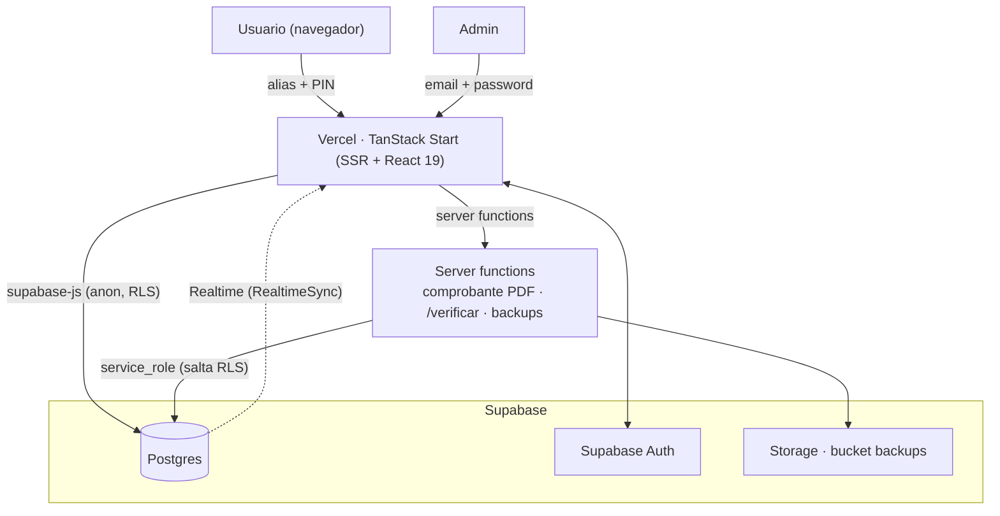

# LA GILIPOLLA 2026 ⚽

Polla mundialista (quiniela de predicciones) del **Bar El Guanábano** para el **Mundial FIFA 2026**.
Los participantes pronostican grupos, marcadores y especiales; el sistema asigna puntos según el
reglamento y mantiene una tabla de posiciones en vivo.

**Producción:** https://lagilipolla-c373bc22.vercel.app

---

## ✨ Funcionalidades

- **Inscripción y acceso** con **alias + PIN de 4 dígitos** (el usuario puede cambiar su PIN desde el menú).
- **Planilla de pronósticos:** 12 grupos (1º y 2º), marcadores del Grupo K (Colombia) y eliminatorias, goleador y arquero.
- **Puntuación automática en SQL** y **tabla de posiciones** en tiempo real con desempates.
- **Resultados oficiales** que carga el admin; el cálculo de puntos se actualiza solo.
- **Comprobante oficial en PDF** con **código QR** verificable en `/verificar/<código>`.
- **Panel de administración:** pagos, resultados, cronograma/fases, especiales y reportes (Excel + backups en la nube).
- **i18n** en español (el catálogo en inglés existe pero el selector está apagado hasta completarlo — ver `ENGLISH_ENABLED` en `src/lib/i18n/index.tsx`).

## 🧱 Stack

| Capa              | Tecnología                              |
| ----------------- | --------------------------------------- |
| Framework         | **TanStack Start** (SSR) + React 19     |
| Estilos           | Tailwind CSS v4 + shadcn/ui             |
| Backend / DB      | **Supabase** (Postgres, Auth, Storage)  |
| Runtime / tooling | **Bun**, Vite, Vitest, ESLint, Prettier |
| Deploy            | **Vercel** (preset Nitro `vercel`)      |

> La **lógica de puntuación vive en SQL** (`calc_pick_points`), no en TypeScript, para que sea la única fuente de verdad.

## 🏛️ Arquitectura

App **full-stack sobre TanStack Start** (SSR + server functions) desplegada en **Vercel**, con
**Supabase** como backend (Postgres + Auth + Storage). El navegador habla directo con Supabase para
lecturas/escrituras del usuario (protegidas por RLS); las operaciones privilegiadas (PDF, backups,
verificación pública) corren en **server functions** con la `service_role`.



**Flujos principales**

- **Auth:** alias+PIN (participantes) / email+password (admin) → Supabase Auth. El PIN deriva el password de la cuenta (`src/lib/auth.ts`).
- **Pronósticos:** el cliente guarda en la tabla `picks` (RLS por usuario). Triggers en BD **validan** (`picks_validate`: un dígito, inmutabilidad, sin grupos repetidos) y **recalculan** puntos (`calc_pick_points`); `get_polla_leaderboard` alimenta la tabla de posiciones.
- **Resultados oficiales:** el admin escribe en el singleton `tournament_state`; `recalc_all_picks` actualiza los puntos de todos y **RealtimeSync** propaga los cambios a los clientes conectados.
- **Comprobante / verificación:** una server function genera el PDF con QR a `${VITE_APP_URL}/verificar/<código>`; la página pública valida con el RPC `get_comprobante_public`.

**Decisiones clave:** puntuación como **fuente única en SQL**; **RLS** + server functions con `service_role` para lo sensible; **migraciones versionadas** (`supabase/migrations/`) como fuente de verdad del esquema; **deploy continuo** (push a `main` → Vercel).

**Capas del código**

- **Rutas/UI** (`src/routes`, `src/components`) → **hooks de datos** (`src/hooks`: `useAuth`, `usePolla`) → **cliente Supabase** (`src/integrations`).
- **Dominio** en `src/lib/polla.ts` (tipos, helpers y espejos TS de la puntuación) y `src/lib/reports.functions.ts` (server functions de PDF/Excel/backup).

## 🚀 Desarrollo local

```bash
bun install
cp .env.example .env   # completa los valores (ver abajo)
bun run dev            # http://localhost:8080
```

### Variables de entorno (`.env`)

```
VITE_SUPABASE_URL=            # URL del proyecto Supabase
VITE_SUPABASE_PUBLISHABLE_KEY=# anon/publishable key (pública)
SUPABASE_URL=
SUPABASE_SERVICE_ROLE_KEY=    # secreto (server-side: backups, /verificar)
VITE_APP_URL=                 # URL pública de la app, sin barra final (para el QR)
```

`.env` está **gitignored**; nunca subas claves al repo (es público). En producción se configuran como
_Environment Variables_ en Vercel.

### Scripts

```bash
bun run dev      # servidor de desarrollo (SSR)
bun run build    # build de producción (genera salida para Vercel)
bun run test     # tests (Vitest)
bun run lint     # ESLint
bun run format   # Prettier
```

Utilidades de operación en [`scripts/`](scripts/README.md): verificación de datos, snapshot de esquema,
export de BD y aplicación de datos oficiales.

## 🗂️ Estructura

```
src/
  routes/        # páginas: index, login, registro, dashboard, planilla,
                 #          leaderboard, cronograma, reglas, verificar, admin/*
  components/    # UI + componentes de dominio (Navbar, Footer, paneles…)
  hooks/         # useAuth, usePolla (datos de torneo/leaderboard)
  lib/           # polla.ts (tipos + puntuación), auth.ts, i18n, reports.functions.ts
  integrations/  # cliente Supabase
supabase/
  migrations/    # migraciones SQL (fuente de verdad del esquema)
  schema.snapshot.sql  # snapshot autogenerado (no editar)
public/          # assets estáticos (logo, banderas…)
reglas/          # reglamento oficial (PDF/XLSX + texto extraído)
scripts/         # utilidades de operación/verificación
```

## 🎯 Reglas de puntuación

| Apuesta            | Puntos                                                                                       |
| ------------------ | -------------------------------------------------------------------------------------------- |
| Grupos (1º y 2º)   | 5 exacto · 3 invertido · 1 uno acertado · 0                                                  |
| Marcador           | 5 exacto · 3 ganador + goles de un equipo · 2 solo ganador · 1 empate/goles de un equipo · 0 |
| Goleador / Arquero | 10 cada uno                                                                                  |
| Desempate          | más aciertos de 5, luego de 3, luego de 2                                                    |

Los marcadores se cuentan a los 90 min + reposición. Cada marcador se puede editar hasta **24 h antes**
del partido; una vez guardado, queda fijo.

**Goleador/Arquero — cómo se compara un nombre escrito contra el jugador oficial:** el
reglamento fija los 10 puntos, pero no dice cómo se decide si el nombre coincide. Esa regla
(tolera typo pequeño y apellido solo, siempre que el equipo confirme) vive en el código
(`especialMatches` en `src/lib/polla.ts` + `especial_matches()` en SQL) y está documentada
para el admin/participantes en [`reglas/ACLARACIONES.md`](reglas/ACLARACIONES.md).

## 🗄️ Base de datos y deploy

- El esquema se versiona en `supabase/migrations/`. Se aplican vía la **Management API** de Supabase
  o al sincronizar con la plataforma conectada.
- El **deploy es automático en Vercel** con cada `git push` a `main`.
- Detalle operativo (deploy, migraciones, backups, reset) en la skill del repo
  [`.claude/skills/gilipolla-ops/SKILL.md`](.claude/skills/gilipolla-ops/SKILL.md).

## 🏟️ Sede

Centro Recreativo y Cultural **El Guanábano**. Polla privada · solo mayores de edad.

---

Desarrollado por **Hackidevs**.
